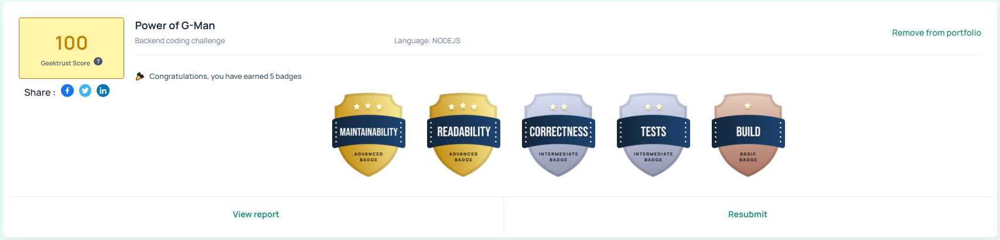

# Geektrust Backend Challenge

## Problem Statement

The problem statement can be found here [Power of G-Man](https://www.geektrust.com/coding/detailed/power-of-g-man)

## Solution

The solution is a NodeJS application that takes a text file as input and prints the output to the console.

* [Approach](#approach)
* [Build](#build)
* [Correctness](#correctness)
* [Unit tests](#unit-tests)


# Approach

Implemented a Gman class which has the following properties and methods.
* class Gman
    * properties
        - sourceLocation
        - targetLocation
        - totalPower
        - turns


    * methods
        - calculateMoves
        - isTurnReqInXDir
        - isTurnReqInYDir
        - calculateTurns
        - calculatePower

Core logic is implemented in calculateMoves method. This method calculates the number of moves required to reach the target location from the source location. It also calculates the number of turns required to reach the target location from the source location. It also calculates the total power required to reach the target location from the source location.

# Build

NPM is the default package manager for NodeJS. NPM can install all the dependencies of a project through the package.json file. It can also update and uninstall packages. In the package.json file, each dependency can specify a range of valid versions using the semantic versioning scheme, allowing developers to auto-update their packages while at the same time avoiding unwanted breaking changes.

A sample `package.json` file can be downloaded from [here](https://raw.githubusercontent.com/geektrust/coding-problem-artefacts/master/NodeJS/package.json)

In your `package.json` file make sure you have an entry for the following:

1. Start script which points to the execution of `geektrust.js`
2. Test script to execute all the unit tests present.

```javascript
"scripts": {
    "start": "node geektrust.js",
    "test": "mocha"
}
```

We run the following command to build you solution.

```
npm ci --silent
```

# Correctness

We expect your program to take the location to the text file as parameter. Input needs to be read from a text file, and output should be printed to the console. The text file will contain only commands in the format prescribed by the respective problem.

This main file, `geektrust.js` should receive in the command line argument and parse the file passed in. Once the file is parsed and the application processes the commands, it should only print the output.

For e.g your `geektrust.js` file will look like this

```javascript
const filename = process.argv[2];
// parse the file and process the command
// print the output
```

## Execution

### No build

We will execute the program using the command 

```
node geektrust.js <absolute_path_to_input_file>
```

### NPM 

Once the `npm install` from the previous build process is complete, we will execute the program using the command

```javascript
npm start --silent <absolute_path_to_input_file>
```

# Unit tests

For NodeJS we support the following frameworks for unit testing

* [Mocha](https://mochajs.org/)
For both the frameworks we use [Istanbul](https://istanbul.js.org/) as the code coverage tool.

## Execution

### Mocha

After `npm install` Mocha based test cases are executed with the following command from the root folder

```javascript
mocha test
```
